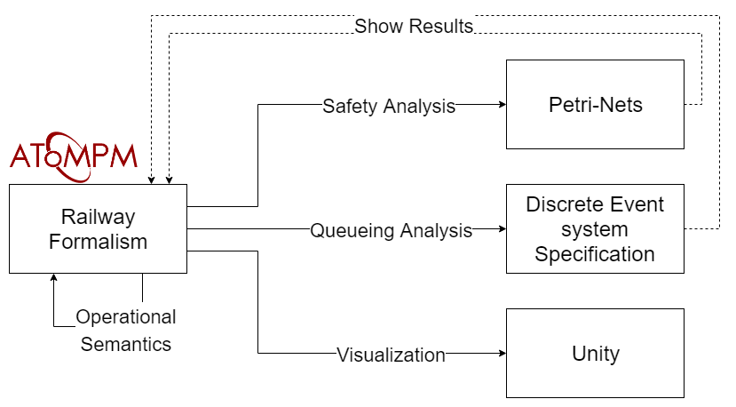

## Mapping the Railway formalism onto different domains



- **Promoter**: Hans Vangheluwe
- **Supervisor**: Simon Van Mierlo

For more information about this research project, read the [report](report/report.pdf) or view the [presentation](report/presentation.pdf).

### Dependencies

- AToMPM: [https://atompm.github.io/](https://atompm.github.io/)
- LoLA: [https://www2.informatik.hu-berlin.de/top/lola/loladoku/index.html](https://www2.informatik.hu-berlin.de/top/lola/loladoku/index.html)
- PythonPDEVS: [http://msdl.cs.mcgill.ca/projects/DEVS/PythonPDEVS](http://msdl.cs.mcgill.ca/projects/DEVS/PythonPDEVS)
- Unity: [https://unity.com/](https://unity.com/)
    - ~~Railway assets: [https://assetstore.unity.com/packages/3d/vehicles/land/simple-trains-cartoon-assets-86794](https://assetstore.unity.com/packages/3d/vehicles/land/simple-trains-cartoon-assets-86794) (import the `.unitypackage` package in the `Railway/Assets/Resources` directory in Unity)~~

### Installation

- Install by running the install script and passing AToMPM's home directory. This script will put the formalisms on its right place for all the users and it will create a working directory for the Railway formalism.

```bash
(sudo) ./install.sh ATOMPM_DIR
```

### Directory Structure

- `Railway`: the Railway formalism modelled in AToMPM
- `TrainSchedule`: the Train Schedule formalism modelled in AToMPM
- `railway_wd`: working directory for the Railway formalism, used to store temporary files etc. (place this folder in AToMPM's root directory)
    - `RailwayDEVS`: the railway model in DEVS
    - `RailwayUnity`: the railway model in Unity
- `report`: the sources of the report and the report itself

### Manual

#### Create Railway model
- Import the `Railway.defaultIcons.metamodel` toolbar
- To define a train's schedule: import the `TrainSchedule.defaultIcons.metamodel` toolbar

#### Operational Semantics
- Run the `T_OperationalSemantics.model` transformation

#### Safety Analysis
- For default analysis: run the `T_SafetyAnalysis.model` transformation
- For custom analysis (using custom properties): run the `T_CustomSafetyAnalysis.model` transformation
- To replay a counterexample:
    - Make sure there was a trace generated (check the `trace` property of a Property)
    - Set `replay` to `true` on the Property object
    - Run the `T_ReplayTrace.model` transformation

#### Queuing Analysis
- Run the `T_QueueingAnalysis.model` transformation
- Alternatively the `T_QueueingAnalysisAfterDEVSTransformation.model` transformation can be ran on a model that has already been transformed to a DEVS model (using `T_ToDEVS.model`)

#### Visualization
- Visualize using a trace:
    - Just run the queueing analysis (`T_QueueingAnalysis.model`) to create a tracefile and `railway.xml` file
    - Open the Unity project
    - Set the `simulateLive` parameter to `false` on the `Main` object (you can also specify the `simulationTimeScaleFactor` if you like)
    - Start the Unity project
- Visualizing live while simulating:
    - You might need to run the queueing analysis beforehand (to create the `railway.xml`), so Unity can instantly load this file
    - Open the Unity project
    - Set the `simulateLive` parameter to `true` on the `Main` object
    - Start the Unity project
    - Run the `T_Visualization.model` transformation (or `T_VisualizationAfterDEVSTransformation.model`)
